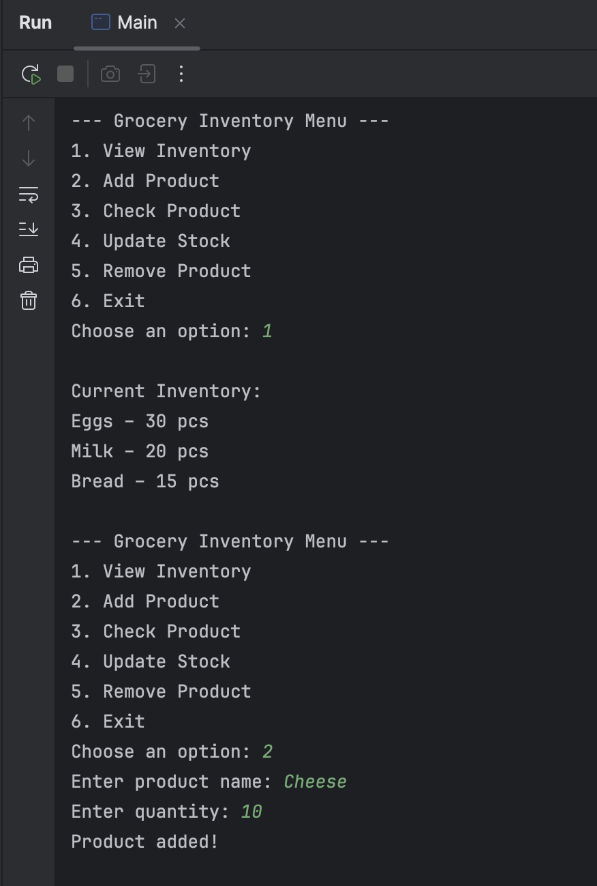
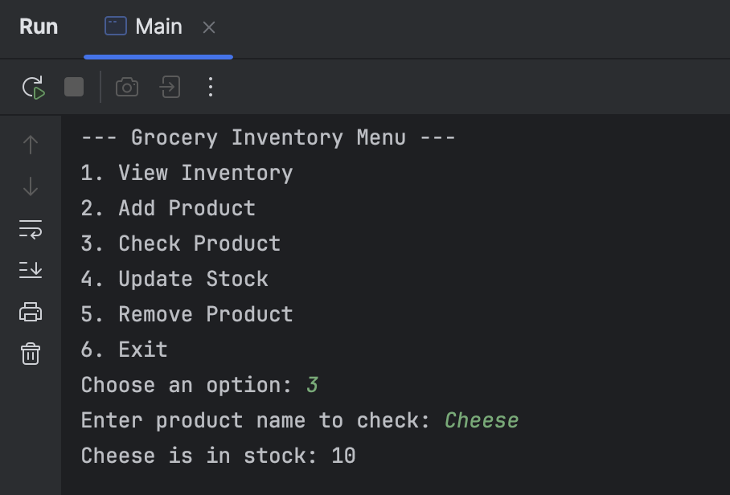
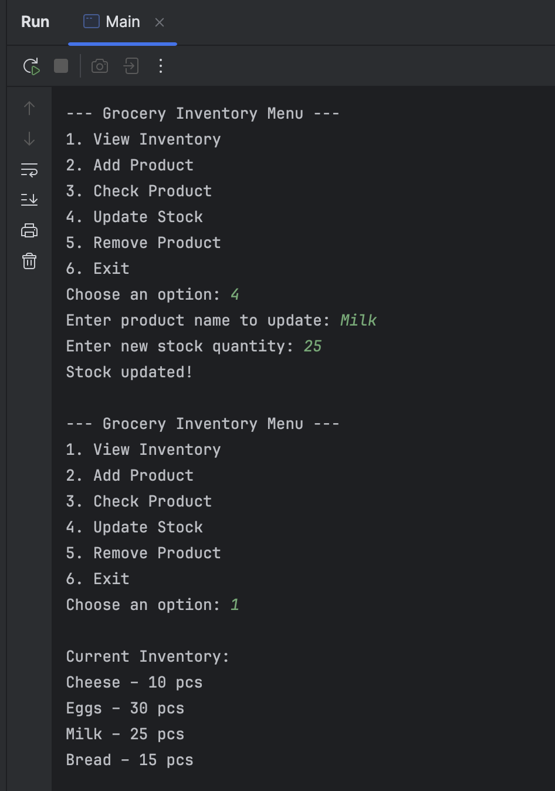
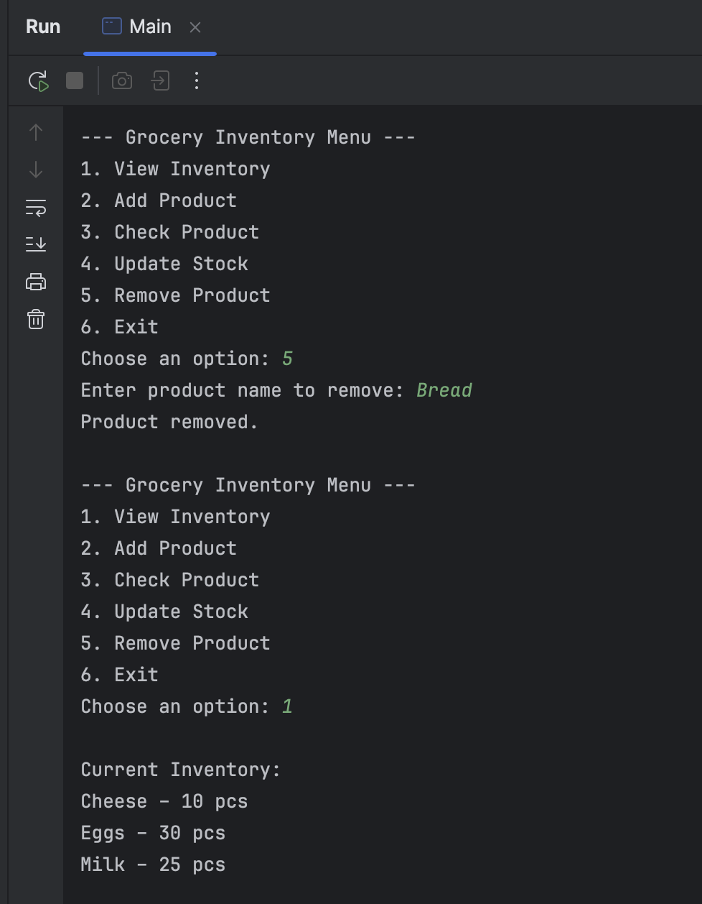
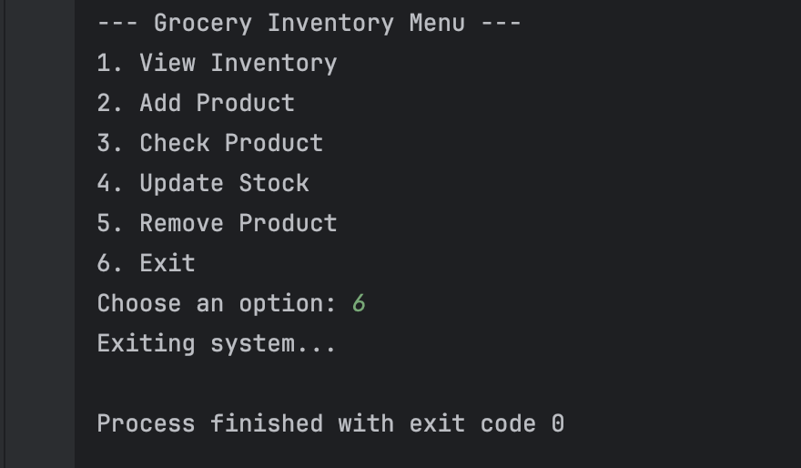
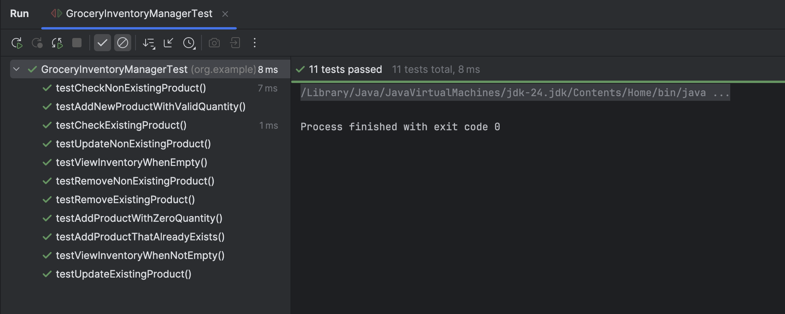

# Lab 1: Part 1 of 2 Grocery Store Inventory System

## Author

**Dzelle Faith R. Tan**

## Description

This program uses HashMap to manage a grocery store’s inventory, where each product has a name and a quantity in stock.

## Screenshot of Output

View Product & Add Product

Check Product

Update Product

Remove Product

Exit

### Unit Testing

Unit Test Output

Test Case Coverage
